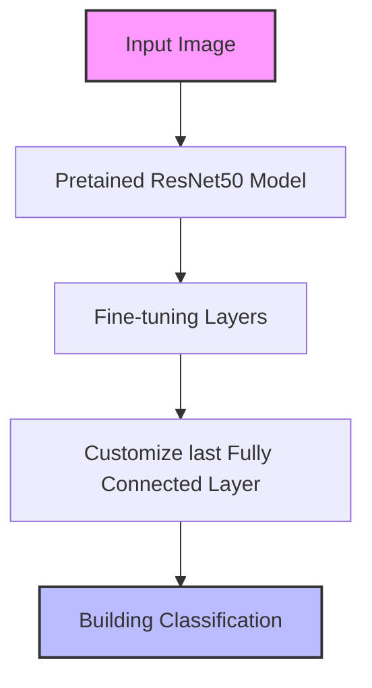

# WhereAmI
## Overview

This project implements a deep learning model to recognize buildings on the UIUC engineering campus. It helps students identify buildings by uploading photos.

## Model Architecture

## Training
### Data Augmentation
- Random Crop: 256px, scale=(0.8, 1.0)
- Rotation: ±30 degrees
- Horizontal Flip: p=0.5
- Color Jitter: brightness=0.2, contrast=0.2
- Grayscale: p=0.1

### Custom Modification
- Modified final fully connected layer
- BatchNormalization
- Dropout (0.4) for regularization
- Fine-tuned last two residual blocks

### Model Configuration
- Batch Size: 16
- Learning Rate: 0.0005
- Optimizer: AdamW
- Weight Decay: 0.05
- Early Stopping: 5 epochs

## Performance
- Training Accuracy: above 95%
- Validation Accuracy: near 80%
- Epoches: 20

