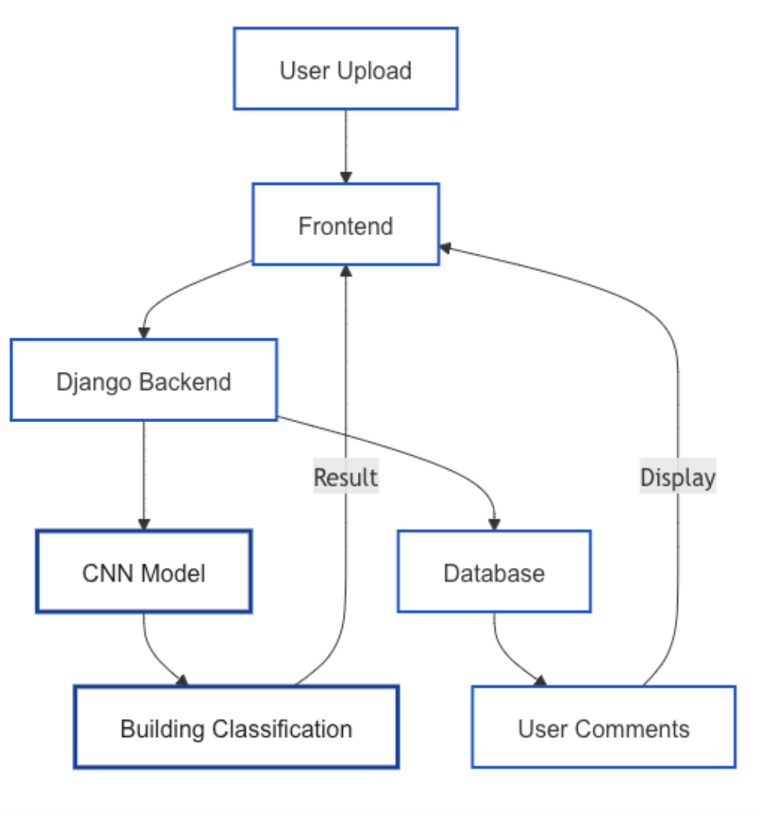

# WhereAmI
## Overview

This project implements a deep learning model to recognize buildings on the UIUC engineering campus. It helps students identify buildings by uploading photos.

## Technical Architecture
<div style="text-align: center;">
    
</div>


## Model Architecture


## Training
### Data Augmentation
- Random Crop: 256px, scale=(0.8, 1.0)
- Rotation: ±30 degrees
- Horizontal Flip: p=0.5
- Color Jitter: brightness=0.2, contrast=0.2
- Grayscale: p=0.1

### Custom Modification
- Modified final fully connected layer
- BatchNormalization
- Dropout (0.4) for regularization
- Fine-tuned last two residual blocks

### Model Configuration
- Batch Size: 16
- Learning Rate: 0.0005
- Optimizer: AdamW
- Weight Decay: 0.05
- Early Stopping: 5 epochs

## Performance
- Training Accuracy: above 95%
- Validation Accuracy: near 80%
- Epoches: 20

## Team Members
### Front End
**Fiona Bai, Shaoshao Xiong**  
- Primary Role: Working on image data processing and frontend development.  
- Skills Focus: JavaScript, CSS, HTML, Django.

### Back End
**Evelyn Zhou, Jay Chen**  
- Primary Role: Training the CNN model and managing the database using Django.
- Skills Focus: Deep learning, Pytorch, Django.

### Shared Responsibilities
- Collecting images.  
- Using Django to connect the front and back end code.  
- Flexible roles with task exchanges likely as the project progresses.

# Run Instructions

## Prerequisites
- Ensure you have **Node.js** (version 16.x or above recommended) installed.
- Ensure you have **npm** (Node Package Manager) installed.

---

## Setup

1. **Install Node.js Dependencies**  
   Navigate to the project root directory and run the following command:
   ```bash
   npm install
## Running the Application

### Start the Backend Server
In the root directory (where `manage.py` is located), run the Django development server:

```bash
python manage.py runserver
```
The app should now be accessible at:
```bash
http://127.0.0.1:8000
```


